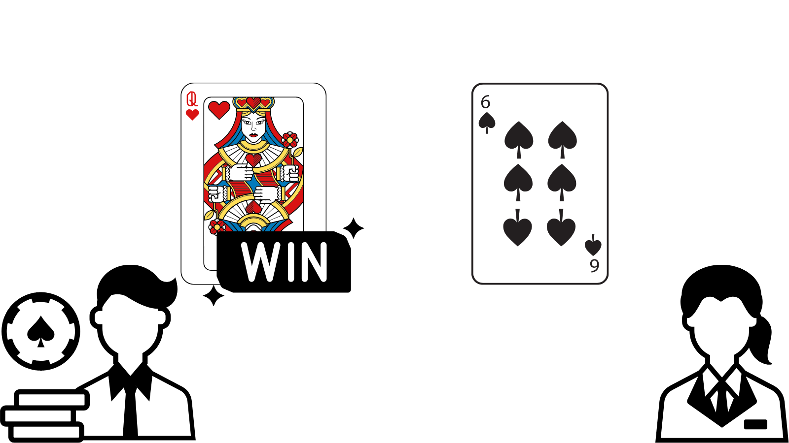
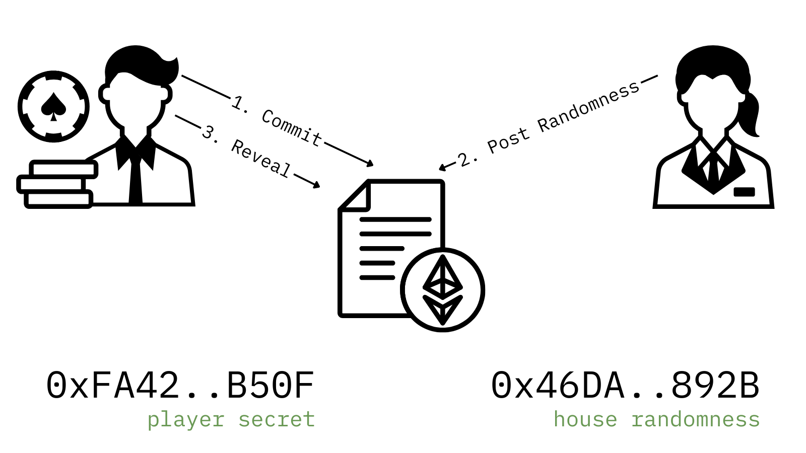
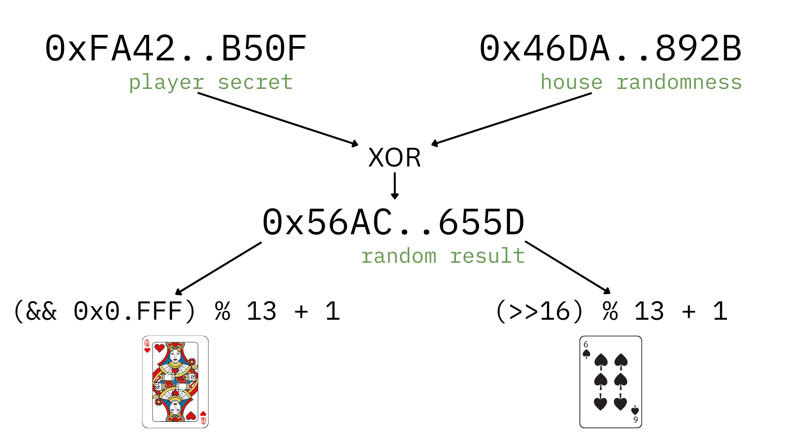
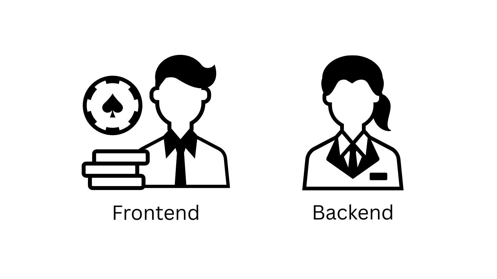
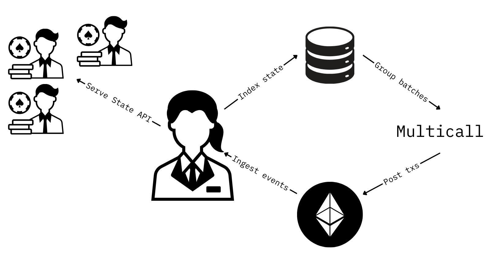
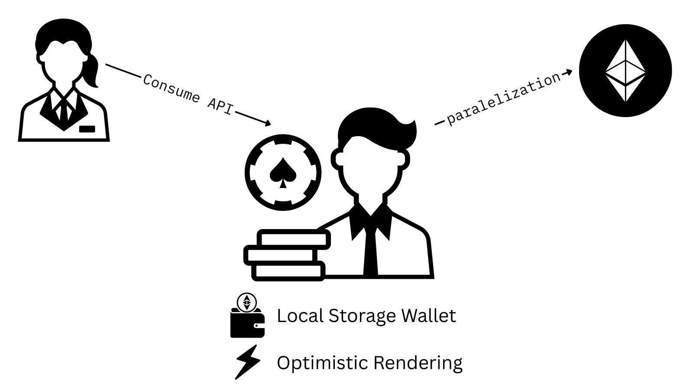

A fast-paced war game built 100% on-chain and deployed on MegaETH Testnet. By using MegaETH’s fast block times and mini blocks API, we aim to deliver a sub 500ms experience. Each round, you and the house draw a card, the higher card wins.


_Each round, the player and the house each draw a card, the higher card wins._

## Randomness generation

Fair randomness is achieved with a simple commit‑reveal sequence:

1. Player posts a hash of their secret random number to the contract.
1. House posts its random number in response.
1. Player reveals the secret.

If either party stalls, a timeout can be triggered, slashing the unresponsive side and refunding the stake.


_Commit‑reveal process ensures neither side can predict or manipulate the outcome._

Once both numbers are on-chain, we XOR them:

```
const combined = houseRandomness ^ playerSecret;
```

From this combined value, two cards are drawn from our 13‑card deck (A, 2–10, J, Q, K):

```
const playerCard =   (combined & 0xFFF) % 13;
const houseCard  = ((combined >> 16) % 13);
```

XOR’ing the numbers yields a fair random seed for both cards.



_Once both player and house randomness has been posted on a smart contract, we XOr them to generate the random number. From there two more random numbers are generated one for each card._

## Architecture Overview

Here’s how we can achieve a fast paced expereiences 100% on-chain.


_The player runs a frontend client on their browser while the house is being run on a backend that controls the game owner wallet._

### House Backend


The backend watches on-chain events via WebSocket and mirrors the full game state in a local database. Then it servers the players state trough a public API. Also this allows the backend to use the multicall contract to post multiple randomness by batching transactions.


_Backend indexing allows fast queries and efficient batch transactions._

## Browser Frontend

To eliminate wallet‑extension delays, we generate a keypair in local storage on first visit. You can deposit, withdraw, or reset your wallet without installing an extension.

State reads default to the house API for speed, but players can point to any RPC provider for a completely trustless flow.

We’ve also added two UX optimizations:
* Optimistic rendering: As soon as the house’s randomness posts, the result displays immediately—no need to wait for the on‑chain resolution.
* Parallel commits: While a reveal is pending confirmation, the next round’s commit can be sent right away, keeping the gameplay loop fluid.


_With all the frontend optimizations we should be able to deliver a seamless, sub‑500 ms experience._

## Getting Started

### Development

Run the frontend.

```
# install a static web server
npm i -g lite-server
# run it
lite-server
```

Create and fill the `.env` file then.

```
# install dependencies
npm install
# launch server
npm start
```

### Production

```
pm2 start lite-server& --name game-frontend
cd backend
pm2 start start.js --name game-backend
```

## License

MIT